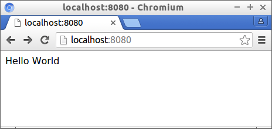

##### Requirements

* 15 minutes
* PHP installed - this is by default on most Operating Systems

##### Achievements

By the end of this tutorial you will be able to:

* write a **Hello World** Application that outputs on the:
    * Command Line (CLI)
    * Browser

---

## What is PHP?

From the **PHP** [website](http://php.net/manual/en/intro-whatis.php)

> PHP (recursive acronym for PHP: Hypertext Preprocessor) is a widely-used open source general-purpose scripting language that is especially suited for web development and can be embedded into HTML.

Well what does this mean? It is very easy to build dynamic websites using **PHP** as the server-side language, which generates **HTML**.

## What does PHP look like?

A simple Hello World application would look like the following:

*File: index.php*
```php
<?php
echo "Hello World";
```

1. The file must end with the extension `.php`
2. The file must begin with the opening tag `<?php`
3. `"` are used to Open/Close a string
4. 'echo' Outputs the string [echo on php website](http://php.net/manual/en/function.echo.php)

## How to run the script?

On the Command Line (CLI), type:

```php
php index.php
```

And the output will be:

```bash
$ php index.php
Hello World
```

*Note: `$` implies the Command Line shell, you did not need to type this.*

## How to the output in the browser?

Seeing it on the Command Line is great, but what about the browser? We will need to get a WebServer running, the easiest way is to use the buil-in PHP WebServer.

*Note: Built-in PHP WebServer is great for Development, but **NOT** Production.*

Go to the directory where you created the `index.php` file and run the following command:

```bash
$ php -S 0.0.0.0:8080
```

1. You are already familiar with the `php` command from before
2. `-S` means built-in WebServer
3. `0.0.0.0` is the IP that the WebServer should listen on. By using `0` it will listen on everything - fine for development
4. `8080` is the port to listen on - fine for development but in production the default port is `80` and therefore not required when accessing a URL

Lets see the script output in the browser, in your browser (ideally **Firefox** or **Chrome**) navigate to ` http://localhost:8080/` and you should see:



## Summary

Now you should know how to create a simple **PHP** script and run it via the Command Line or via the Built-in **PHP** WebServer and see the output to the Command Line or the Browser respectively.
